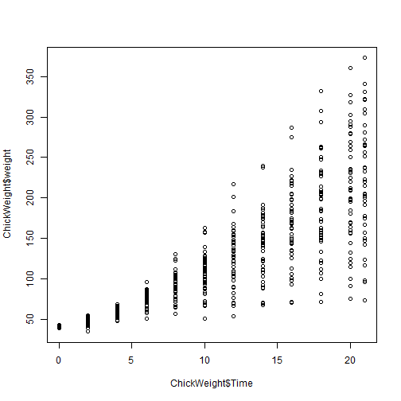

Developing Data Products Course Project Presentation
========================================================
author: Datta Khot
date: Aug 23, 2015

Course Project Overview
========================================================

In this course project, we use default dataset 'ChickWeight' to build a shiny application. 
The application builds different model using caret package and user selected regresion
algorithms. 

User can choose one of the following algorithms to build model and see model information.

- lm (Linear Model)
- glm (Generalized Linear Model)


Sample ChickWeight dataset records
========================================================


```r
library(datasets)
data("ChickWeight")
head(ChickWeight)
```

```
  weight Time Chick Diet
1     42    0     1    1
2     51    2     1    1
3     59    4     1    1
4     64    6     1    1
5     76    8     1    1
6     93   10     1    1
```


Chickweight dataset plot and summary
========================================================

Plot showing chick weight against time
 

***
ChickWeight dataset summary

```
     weight           Time           Chick     Diet   
 Min.   : 35.0   Min.   : 0.00   13     : 12   1:220  
 1st Qu.: 63.0   1st Qu.: 4.00   9      : 12   2:120  
 Median :103.0   Median :10.00   20     : 12   3:120  
 Mean   :121.8   Mean   :10.72   10     : 12   4:118  
 3rd Qu.:163.8   3rd Qu.:16.00   17     : 12          
 Max.   :373.0   Max.   :21.00   19     : 12          
                                 (Other):506          
```


Model building and Prediction using linear modelling algorithm
========================================================


```r
library(caret)
inTrain <- createDataPartition(y=ChickWeight$weight, p=0.7, list=FALSE)
training <- ChickWeight[inTrain,]
testing <- ChickWeight[-inTrain,]
set.seed(1234)
modelFit <- train(weight ~ Time, data=training, method="glm")
predictions <- predict(modelFit, newdata=testing)
head(predictions)
```

```
[1]  62.45001 170.50745 188.51702  44.44043  98.46915 116.47873
```
